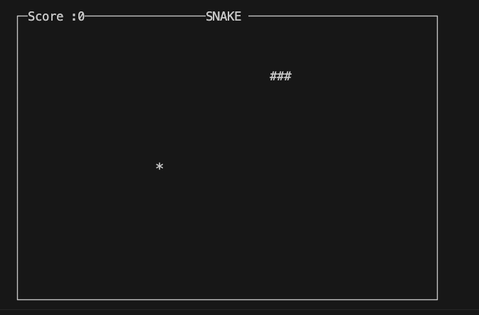
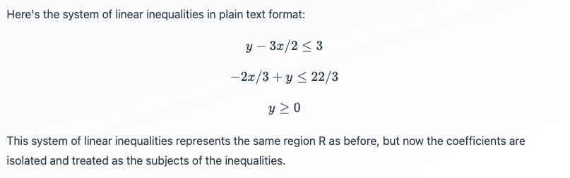
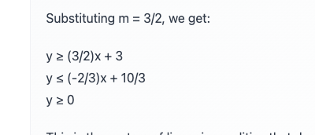
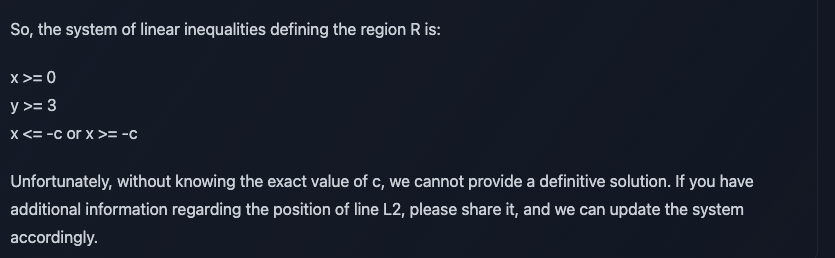

<div align="center">

# Pantheon Lab Programming Assignment

<a href="https://pytorch.org/get-started/locally/"></a>
<a href="https://pytorchlightning.ai/"></a>
<a href="https://hydra.cc/"></a>
<a href="https://github.com/ashleve/lightning-hydra-template"></a><br>

</div>

## My Answers to the Questions of the GAN Problem
**Q: What is the role of the discriminator in a GAN model? Use this project's discriminator as an example.**

A: The discriminator in a GAN model distinguish whether an input is real (from the data) or generated by the generator. In our task, we are actually implementing a Conditional GAN, the discriminator takes in the input, which is the image, along with its proclaimed label (the number of the image), and the discriminator predicts whether the image is real or not.

The discriminator helps the generator to train itself, since the output fake images of the generator is passed to the discriminator in an attempt to fool the discriminator into thinking that the fake images are real, and the loss function encourages the generator to successfully full the discriminator. 

**Q: The generator network in this code base takes two arguments: `noise` and `labels`.
What are these inputs and how could they be used at inference time to generate an image of the number 5?**

A: The labels are the classes to be generated, in this case it is the numbers to be generated, which takes values 0-9. The noise are provided to give variety to the images, it usually comes from a probabilty distribution, I used the gaussian distribution in this case.

To generate image of number 5 at inference time, we can set label to be 5, and set noise to a random probabilty distribution with a size = (n_images, latent_dim), such that different noise values generates different images of the number 5

**Q: What steps are needed to deploy a model into production?**

A: After training the model, we may contanerize the model using Docker or other tools so that it the model can be ran across different environments. We can choose a cloud framework such as AWS Sagemaker to host the model. We may construct a data pipeline and develop interfaces such as RESTful API to interact with the model. After deployment, we have to conduct continuous mainetenance, CI/CD tasks, and utilize new data for tuning the model. 

**Q: If you wanted to train with multiple GPUs, 
what can you do in pytorch lightning to make sure data is allocated to the correct GPU?**

A: Assuming we are using CUDA, we may pass the gpus we want to use into the Trainer's instantiation, e.g. 
trainer = Trainer(gpus=[0, 1, 5], device = 'cuda')

This way we are only using the gpus number 0, 1, 5. Or we may override the configurations at command line using trainer.gpus=[0,1,5]

## Difficulties 

1. Installing dependencies using pip did not work for my machine. I tried using pip3 and installing with 'python3 -m pip' but still got the error 'cannot build wheel' for some secondary dependencies like numpy. Plus, the installation process was long as the installer had to check many versions of dependencies to see which is compatible, I suspect that it is because some of the dependencies are not strict (e.g. `pytorch-lightning==1.5.*`) leading to the lengthy installation process. I solved this by using a shell command to prioritize installation by conda
2. I was unfamiliar with the syntax for the Hydra configuration files and cannot link the config files to the model functions, [this helped.](https://omegaconf.readthedocs.io/en/2.1_branch/usage.html#config-node-interpolation)
3. When I was reading through the source code to the model, I see that the discriminator lacked a sigmoid function to map its output into probability. Upon adding the sigmoid, the model still gave similar results but the run time was much slower. I suspect that it was taken away originally to save computational time.
4. The wandb image logger expects a channel last image array while pytorch supplies a channel-first image array. I rearranged the axes using `torch.permute()`.

## Training Results
With 20 epochs I was able to produce this result


And the loss curves for the generator and the discriminator as follows:


## Answers to Chatbot Assignment
I chose to compare the three following LLMs:

1. CohereForAI/c4ai-command-r-plus
2. meta-llama/Meta-Llama-3-70B-Instruct
3. mistralai/Mistral-7B-Instruct-v0.2

### Content Quality
We assess content quality with these areas: **Reasoning, Math**, **Coding** and **New Info**

#### Reasoning
I gave a reasoning puzzle for the chatbots to solve:
> There are three killers in a room originally. A person goes into the room and kills someone in the room. How many killers are there in the room now? Explain your answer.

Answers from R+ is the most concise and correct.
>There are still three killers in the room. The person who went into the room is also a killer, as they have killed someone.

Answer from Llama 3 is correct but not as efficiently conveyed:
<blockquote>
A classic lateral thinking puzzle!
   
At first glance, it seems like a simple arithmetic problem: 3 killers - 1 person killed = 2 killers. But wait, there's a twist!

The person who went into the room and killed someone is also a killer. So, we need to count them as a killer too.

Initially, there were 3 killers in the room. One of them got killed, leaving 2 original killers. But now, we have a new killer who entered the room and committed a murder. Therefore, there are still 3 killers in the room.

The answer is: there are still 3 killers in the room.
</blockquote>

Answer from Mistral 7B is incorrect.
<blockquote>
Initially, there are three killers in the room. When a new person enters the room and commits a murder, the total number of killers in the room increases by one. So, the final count of killers in the room is four. One important thing to clarify here is that the original three killers remain killers regardless of whether they have killed again or not. Once someone has taken a life, they retain that status as a killer even if they don't continue killing afterwards. Additionally, the new person entering the room becomes a killer upon taking a life. Hence, the total number of killers in the room is now four.
</blockquote>

**Command R+** Wins in reasoning.

#### Coding 
I asked all of them to program Snake in python. For consistency sake I ask all of them to code with the python curses library. I gave them 5 tries, if the program returns an error I reported it to them for fixes.

Command R+ fails all 5 tries. 

Llama 3 produced a non-working program initially, after reporting the error for it to fix for 3 times it worked.



Mistral 7B fails to produce any coherent snake program.

**Llama 3** wins in Coding.

#### Knowledge Cutoff
I asked them when their knowledge cutoff is, and asked them the population of Hong Kong now. 
With web search all of them produces similar results, they all cited two sources, 7.5M and 7.685M respectively.
Without web search, R+ gave results from Jan 2023, Llama gave results from mid 2022 firstly, but after prompting for newer sources it was able to give me the Jan 2023 source as well. Mistral gave info from 2021.

Asking them their knowledge cutoffs, R+ gave Jan 2023. Llama 3 gave 2021, yet upon searching I found that it was until Dec 2023. Mistral gave 2021 yet upon search I fonud that it was trained until Dec 2023. It may be that HuggingChat uses an earlier snapshot of these models?

**Command R+** wins knowledge cutoff


#### Maths 
I took a question from the DSE Maths Exam about Linear Inequalities.
<blockquote>
The straight lines L1, L2, are perpendicular to each other, The y intercept of L1 is 3. It is given that L1 and L2 intersects at point (2, 6), Let R be the region bounded by L1, L2 (the region includes the boundary) and the x-axis. Give the system of linear inequalities of R. 
</blockquote>

Command R+ gave a perfect answer with steps.




Llama 3 gave a wrong answer, note the wrong signs of the first inequality and the incorrect values at the second.




Mistral 7B gave a wrong answer, and even denied that there were a definitive solution




**Command R+** wins maths


For Content Quality, Command R+ Wins


### Contextual Understanding
I took ideas from this paper: [Natural Language Inference in Context - Investigating Contextual Reasoning over Long Texts (Liu et al. 2020)](https://arxiv.org/pdf/2011.04864). I used an example from the ConTRoL dataset. It features a paragraph of text supplied to the LLM (the premise), and some hypotheses about the text to be answered with three choices: logical entailment, contradiction, or neutral. The example is as below:
<blockquote>
This passage provides information on the subsidising of renewable energy and its effect on the usage of fossil fuels. The issue of subsidising sources of renewable energy came to the forefront of global politics as record emissions levels continue to be reached despite caps on carbon emissions being agreed up by several global powers. However, renewable energy sources tend more expensive than their fossil-fuel counter parts. In this way, renewable energy cannot be seen as a realistic alternative to fossil-fuel until it is at a price universally achievable. On the opposite side of the spectrum, commentators note that the average temperature is expected to rise by four degrees by the end of the decade. In order to prevent this, they suggest carbon emissions must be reduced by seventy per cent by 2050. Such commentators advocate government subsidised renewable energy forms as a way to achieve this target.
</blockquote>

And the hypothesis, with the correct answer being **entailment**:
<blockquote>
Government subsidiary could reduce renewable energy cost
</blockquote>
The above hypothesis tests logical contextual reasoning.

All three model gets it right.

I tried a much longer one (939 words), almost 7 times longer than the first: 
<blockquote>
Thomas Young The Last True Know-It-All Thomas Young (1773-1829) contributed 63 articles to the Encyclopedia Britannica, including 46 biographical entries (mostly on scientists and classicists) and substantial essays on Bridge, Chromatics, Egypt, Languages and Tides. Was someone who could write authoritatively about so many subjects a polymath, a genius or a dilettante? In an ambitious new biography, Andrew Robinson argues that Young is a good contender for the epitaph the last man who knew everything. Young has competition, however: The phrase, which Robinson takes for his title, also serves as the subtitle of two other recent biographies....(omitted)....
Very little evidence survives about the complexities of Youngs relationships with his mother and father. Robinson does not credit them, or anyone else, with shaping Youngs extraordinary mind. Despite the lack of details concerning Youngs relationships, however, anyone interested in what it means to be a genius should read this book.
</blockquote>

This time with more hypotheses
<blockquote>
1. All Youngs articles were published in Encyclopedia Britannica.(Contradiction)

2. The last man who knew everything has also been claimed to other people. (Entailed)

3. Young suffered from a disease in his later years. (Neutral)
</blockquote>
Hypothesis 1 and 2 may test the coreferential reasoning. 

Results:
Control R+: 3/3
LLama 3: 3/3
Mistral 7B: 1/3 (Gets third one)


On a test case about temporal reasoning, with this hypothesis that tests temporal reasoning:
>On average, produce worth 4,200 is thrown away every week.
Control R+ fails while Llama and Mistral gets it right.

On contextual understanding Llama 3 is the most consistent.


## What is all this?
This "programming assignment" is really just a way to get you used to
some of the tools we use every day at Pantheon to help with our research.

There are 4 fundamental areas that this small task will have you cover:

1. Getting familiar with training models using [pytorch-lightning](https://pytorch-lightning.readthedocs.io/en/latest/starter/new-project.html)

2. Using the [Hydra](https://hydra.cc/) framework

3. Logging and reporting your experiments on [weights and biases](https://wandb.ai/site)

4. Showing some basic machine learning knowledge

## What's the task?
The actual machine learning task you'll be doing is fairly simple! 
You will be using a very simple GAN to generate fake
[MNIST](https://pytorch.org/vision/stable/datasets.html#mnist) images.

We don't excpect you to have access to any GPU's. As mentioned earlier this is just a task
to get you familiar with the tools listed above, but don't hesitate to improve the model
as much as you can!

## What you need to do

To understand how this framework works have a look at `src/train.py`. 
Hydra first tries to initialise various pytorch lightning components: 
the trainer, model, datamodule, callbacks and the logger.

To make the model train you will need to do a few things:

- [ ] Complete the model yaml config (`model/mnist_gan_model.yaml`)
- [ ] Complete the implementation of the model's `step` method
- [ ] Implement logging functionality to view loss curves 
and predicted samples during training, using the pytorch lightning
callback method `on_epoch_end` (use [wandb](https://wandb.ai/site)!) 
- [ ] Answer some questions about the code (see the bottom of this README)

**All implementation tasks in the code are marked with** `TODO`

Don't feel limited to these tasks above! Feel free to improve on various parts of the model

For example, training the model for around 20 epochs will give you results like this:


## Getting started
After cloning this repo, install dependencies
```yaml
# [OPTIONAL] create conda environment
conda create --name pantheon-py38 python=3.8
conda activate pantheon-py38

# install requirements
pip install -r requirements.txt
```

Train model with experiment configuration
```yaml
# default
python run.py experiment=train_mnist_gan.yaml

# train on CPU
python run.py experiment=train_mnist_gan.yaml trainer.gpus=0

# train on GPU
python run.py experiment=train_mnist_gan.yaml trainer.gpus=1
```

You can override any parameter from command line like this
```yaml
python run.py experiment=train_mnist_gan.yaml trainer.max_epochs=20 datamodule.batch_size=32
```

The current state of the code will fail at
`src/models/mnist_gan_model.py, line 29, in configure_optimizers`
This is because the generator and discriminator are currently assigned `null`
in `model/mnist_gan_model.yaml`. This is your first task in the "What you need to do" 
section.

## Open-Ended tasks (Bonus for junior candidates, expected for senior candidates)

Staying within the given Hydra - Pytorch-lightning - Wandb framework, show off your skills and creativity by extending the existing model, or even setting up a new one with completely different training goals/strategy. Here are a few potential ideas:

- **Implement your own networks**: you are free to choose what you deem most appropriate, but we recommend using CNN and their variants if you are keeping the image-based GANs as the model to train
- **Use a more complex dataset**: ideally introducing color, and higher resolution
- **Introduce new losses, or different training regimens**
- **Add more plugins/dependecy**: on top of the provided framework
- **Train a completely different model**: this may be especially relevant to you if your existing expertise is not centered in image-based GANs. You may want to re-create a toy sample related to your past research. Do remember to still use the provided framework.

## Questions

Try to prepare some short answers to the following questions below for discussion in the interview.

* What is the role of the discriminator in a GAN model? Use this project's discriminator as an example.

* The generator network in this code base takes two arguments: `noise` and `labels`.
What are these inputs and how could they be used at inference time to generate an image of the number 5?

* What steps are needed to deploy a model into production?

* If you wanted to train with multiple GPUs, 
what can you do in pytorch lightning to make sure data is allocated to the correct GPU? 


## Submission

- Using git, keep the existing git history and add your code contribution on top of it. Follow git best practices as you see fit. We appreciate readability in the commits
- Add a section at the top of this README, containing your answers to the questions, as well as the output `wandb` graphs and images resulting from your training run. You are also invited to talk about difficulties you encountered and how you overcame them
- Link to your git repository in your email reply and share it with us/make it public

# Chatbot Assignment:

To complete this assignment, you are required to create assistants in [HuggingChat](https://huggingface.co/chat/settings/assistants/new) and address the following questions:

* Compare atleast 3 different models and provide insights on Content Quality, Contextual Understanding, Language Fluency and Ethical Considerations with examples.

* What are the parameters that can be used to control response. Explain in detail.

* Explore various techniques used in prompt engineering, such as template-based prompts, rule-based prompts, and machine learning-based prompts and provide what are the challenges and considerations in designing effective prompts with examples.

* What is retrieval-augmented generation(RAG) and how is it applied in natural language generation tasks?

<br>
