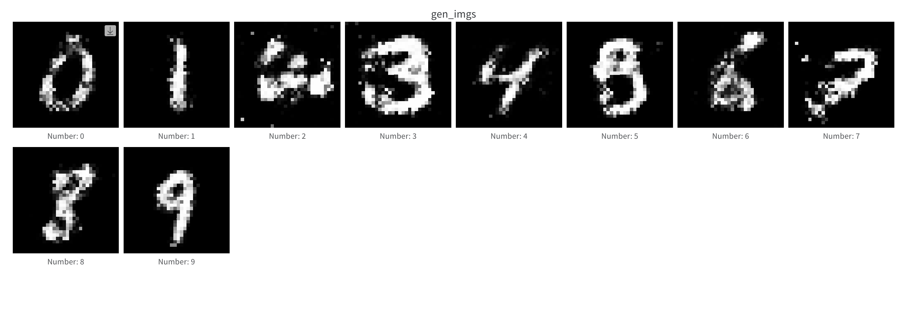
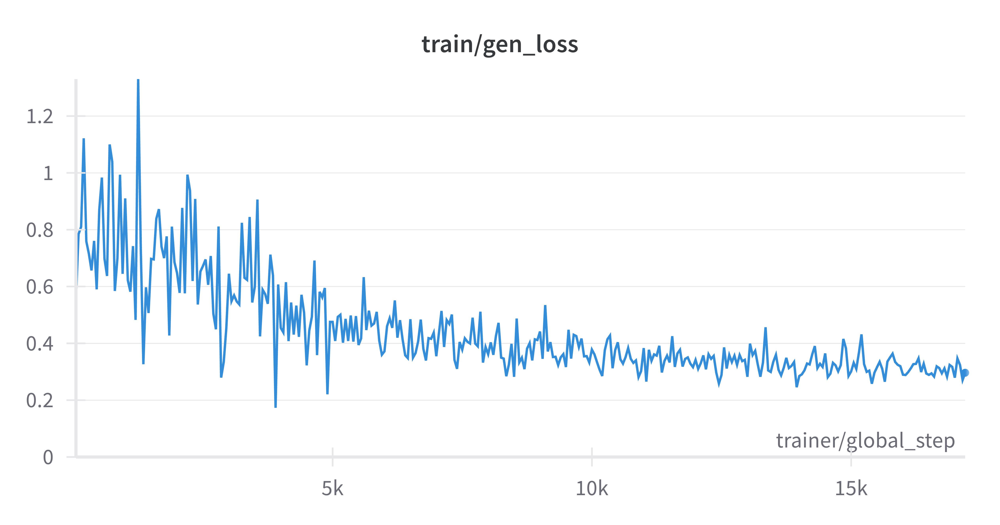
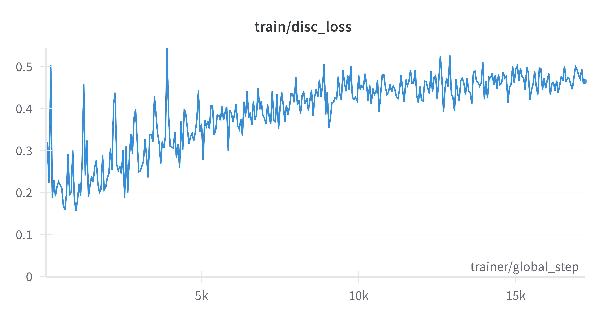
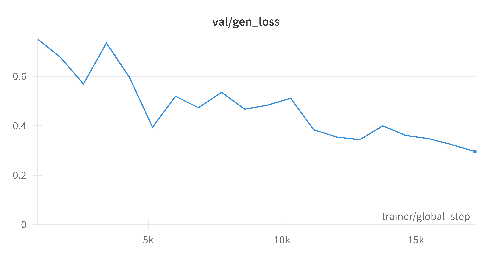
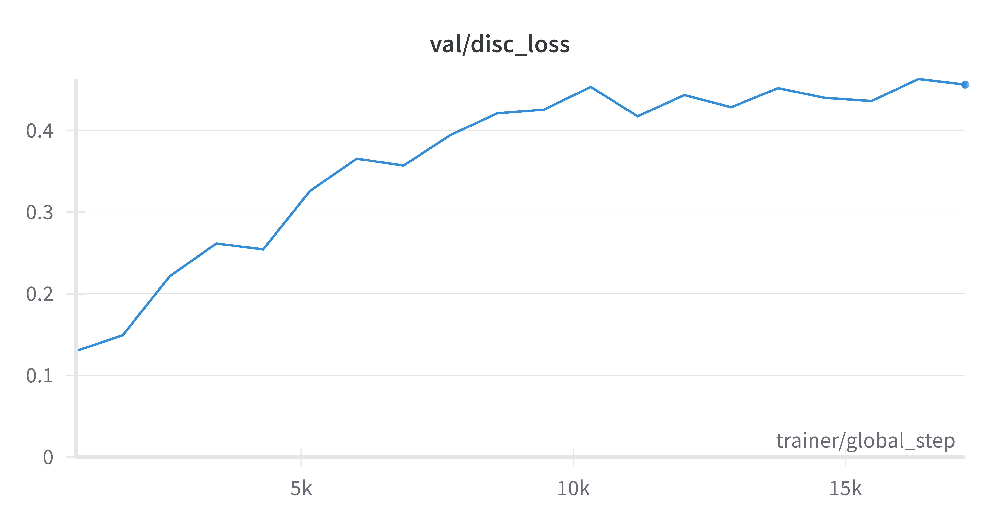
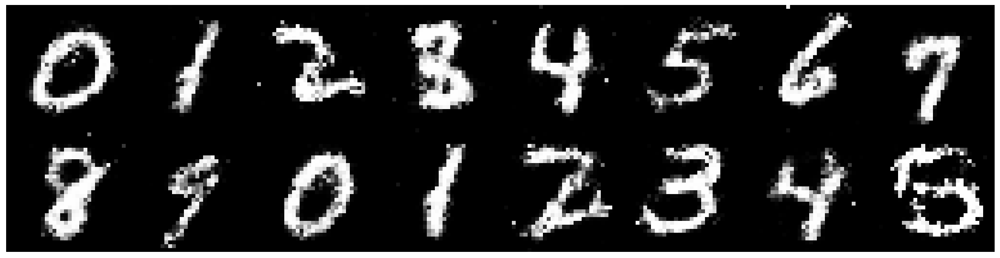

<div align="center">

# Pantheon Lab Programming Assignment

<a href="https://pytorch.org/get-started/locally/"></a>
<a href="https://pytorchlightning.ai/"></a>
<a href="https://hydra.cc/"></a>
<a href="https://github.com/ashleve/lightning-hydra-template"></a><br>

</div>

## My Answers to the Questions
* What is the role of the discriminator in a GAN model? Use this project's discriminator as an example.

The discriminator in a GAN model distinguish whether an input is real (from the data) or generated by the generator. In our task, we are actually implementing a Conditional GAN, the discriminator takes in the input, which is the image, along with its proclaimed label (the number of the image), and the discriminator predicts whether the image is of that label or not.

The discriminator helps the generator to train itself, since the output fake images of the generator is passed to the discriminator in an attempt to fool the discriminator into thinking that the fake images are real, and the loss function encourages the generator to successfully full the discriminator. 

* The generator network in this code base takes two arguments: `noise` and `labels`.
What are these inputs and how could they be used at inference time to generate an image of the number 5?

The labels are the classes to be generated, in this case it is the numbers to be generated, which takes values 0-9. The noise are provided to give variety to the images, it usually comes from a probabilty distribution, I used the gaussian distribution in this case.

To generate image of number 5 at inference time, we can set label to be 5, and set noise to a random probabilty distribution with a size = (n_images, latent_dim), such that different noise values generates different images of the number 5

* What steps are needed to deploy a model into production?

After training the model, we may contanerize the model using Docker or other tools so that it the model can be ran across different environments. We can choose a cloud framework such as AWS Sagemaker to host the model. We may construct a data pipeline and develop interfaces such as RESTful API to interact with the model. After deployment, we have to conduct continuous mainetenance, CI/CD tasks, and utilize new data for tuning the model. 

## Training Results
With 20 epochs I was able to produce this result


And the loss curves for the generator and the discriminator as follows:







## What is all this?
This "programming assignment" is really just a way to get you used to
some of the tools we use every day at Pantheon to help with our research.

There are 4 fundamental areas that this small task will have you cover:

1. Getting familiar with training models using [pytorch-lightning](https://pytorch-lightning.readthedocs.io/en/latest/starter/new-project.html)

2. Using the [Hydra](https://hydra.cc/) framework

3. Logging and reporting your experiments on [weights and biases](https://wandb.ai/site)

4. Showing some basic machine learning knowledge

## What's the task?
The actual machine learning task you'll be doing is fairly simple! 
You will be using a very simple GAN to generate fake
[MNIST](https://pytorch.org/vision/stable/datasets.html#mnist) images.

We don't excpect you to have access to any GPU's. As mentioned earlier this is just a task
to get you familiar with the tools listed above, but don't hesitate to improve the model
as much as you can!

## What you need to do

To understand how this framework works have a look at `src/train.py`. 
Hydra first tries to initialise various pytorch lightning components: 
the trainer, model, datamodule, callbacks and the logger.

To make the model train you will need to do a few things:

- [ ] Complete the model yaml config (`model/mnist_gan_model.yaml`)
- [ ] Complete the implementation of the model's `step` method
- [ ] Implement logging functionality to view loss curves 
and predicted samples during training, using the pytorch lightning
callback method `on_epoch_end` (use [wandb](https://wandb.ai/site)!) 
- [ ] Answer some questions about the code (see the bottom of this README)

**All implementation tasks in the code are marked with** `TODO`

Don't feel limited to these tasks above! Feel free to improve on various parts of the model

For example, training the model for around 20 epochs will give you results like this:



## Getting started
After cloning this repo, install dependencies
```yaml
# [OPTIONAL] create conda environment
conda create --name pantheon-py38 python=3.8
conda activate pantheon-py38

# install requirements
pip install -r requirements.txt
```

Train model with experiment configuration
```yaml
# default
python run.py experiment=train_mnist_gan.yaml

# train on CPU
python run.py experiment=train_mnist_gan.yaml trainer.gpus=0

# train on GPU
python run.py experiment=train_mnist_gan.yaml trainer.gpus=1
```

You can override any parameter from command line like this
```yaml
python run.py experiment=train_mnist_gan.yaml trainer.max_epochs=20 datamodule.batch_size=32
```

The current state of the code will fail at
`src/models/mnist_gan_model.py, line 29, in configure_optimizers`
This is because the generator and discriminator are currently assigned `null`
in `model/mnist_gan_model.yaml`. This is your first task in the "What you need to do" 
section.

## Open-Ended tasks (Bonus for junior candidates, expected for senior candidates)

Staying within the given Hydra - Pytorch-lightning - Wandb framework, show off your skills and creativity by extending the existing model, or even setting up a new one with completely different training goals/strategy. Here are a few potential ideas:

- **Implement your own networks**: you are free to choose what you deem most appropriate, but we recommend using CNN and their variants if you are keeping the image-based GANs as the model to train
- **Use a more complex dataset**: ideally introducing color, and higher resolution
- **Introduce new losses, or different training regimens**
- **Add more plugins/dependecy**: on top of the provided framework
- **Train a completely different model**: this may be especially relevant to you if your existing expertise is not centered in image-based GANs. You may want to re-create a toy sample related to your past research. Do remember to still use the provided framework.

## Questions

Try to prepare some short answers to the following questions below for discussion in the interview.

* What is the role of the discriminator in a GAN model? Use this project's discriminator as an example.

* The generator network in this code base takes two arguments: `noise` and `labels`.
What are these inputs and how could they be used at inference time to generate an image of the number 5?

* What steps are needed to deploy a model into production?

* If you wanted to train with multiple GPUs, 
what can you do in pytorch lightning to make sure data is allocated to the correct GPU? 

Assuming we are using CUDA, we may pass the gpus we want to use into the Trainer's instantiation, e.g. 
trainer = Trainer(gpus=[0, 1, 5], device = 'cuda')

This way we are only using the gpus number 0, 1, 5. Or we may override the configurations at command line using trainer.gpus=[0,1,5]

## Submission

- Using git, keep the existing git history and add your code contribution on top of it. Follow git best practices as you see fit. We appreciate readability in the commits
- Add a section at the top of this README, containing your answers to the questions, as well as the output `wandb` graphs and images resulting from your training run. You are also invited to talk about difficulties you encountered and how you overcame them
- Link to your git repository in your email reply and share it with us/make it public

# Chatbot Assignment:

To complete this assignment, you are required to create assistants in [HuggingChat](https://huggingface.co/chat/settings/assistants/new) and address the following questions:

* Compare atleast 3 different models and provide insights on Content Quality, Contextual Understanding, Language Fluency and Ethical Considerations with examples.

* What are the parameters that can be used to control response. Explain in detail.

* Explore various techniques used in prompt engineering, such as template-based prompts, rule-based prompts, and machine learning-based prompts and provide what are the challenges and considerations in designing effective prompts with examples.

* What is retrieval-augmented generation(RAG) and how is it applied in natural language generation tasks?

<br>
